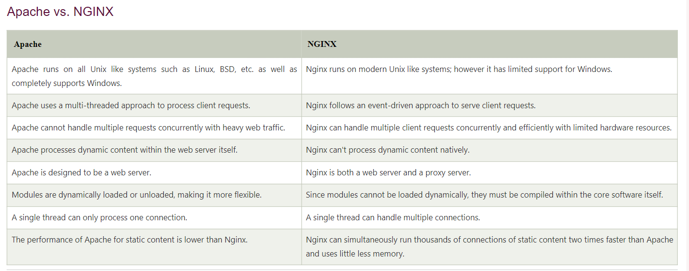

## Cari perbandingan head to head antara NGINX dengan Apache dan jelaskan!

 

  

 

keuntungan menggunakan NGINX dibanding Apache :

- Lebih ringan
- Lebih cepat
- Lebih mudah dikonfigurasi
- Lebih aman
- Lebih fleksibel

## Kenapa sebuah website harus memiliki webserver?

Website membutuhkan sebuah webserver untuk memproses permintaan yang diterima melalui jaringan. Webserver tersebut akan mengirimkan kembali data yang diminta oleh client. Tugas utama webserver adalah menampilkan konten situs web melalui penyimpanan, pemrosesan, dan pengiriman halaman web ke pengguna. Selain HTTP, webserver juga mendukung SMTP (Simple Mail Transfer Protocol) dan FTP (File Transfer Protocol), yang digunakan untuk email, transfer file, dan penyimpanan.

hardware webserver terhubung ke internet dan memungkinkan pertukaran data dengan perangkat lain yang terhubung, sementara software webserver mengontrol cara pengguna mengakses file yang dihosting. Proses webserver adalah contoh model klien/server. Semua komputer yang menghosting situs web harus memiliki software webserver.

## Apa perbedaan proxy dan reverse proxy?

Proxy adalah sebuah server yang berfungsi sebagai penghubung antara klien dan server. Proxy server menerima permintaan dari klien, kemudian mengirimkan permintaan tersebut ke server tujuan. Kemudian, proxy server menerima balasan dari server tujuan, dan mengirimkannya kembali ke klien. Proxy server dapat berfungsi sebagai cache, firewall, dan load balancer.

Reverse proxy adalah sebuah proxy yang berfungsi sebagai penghubung antara klien dan server. Reverse proxy server menerima permintaan dari klien, kemudian mengirimkan permintaan tersebut ke server tujuan. Kemudian, reverse proxy server menerima balasan dari server tujuan, dan mengirimkannya kembali ke klien. Reverse proxy server dapat berfungsi sebagai cache, firewall, dan load balancer.
