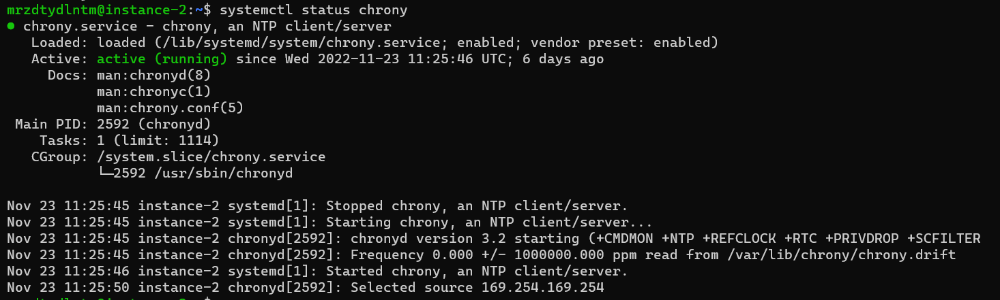

## Apa itu systemctl?

Systemctl adalah perintah yang digunakan untuk mengelola service pada linux. Perintah ini dapat digunakan untuk memulai, menghentikan, mematikan, restart, dan lain sebagainya. Systemctl merupakan bagian dari systemd. systemctl juga berguna untuk mengelola unit-unit sistem yang ada di Linux. Unit-unit sistem yang dimaksud di sini adalah service, socket, device, mount, automount, target, dan slice. Unit-unit ini dapat dimanage dengan menggunakan systemctl.

## Ketika kita sudah menggunakan command atau perintah systemctl status apa saja output yang di dapatkan?

1. Active: active (running) = berarti service sedang berjalan
2. Active: inactive (dead) = berarti service tidak berjalan
3. Active: failed = berarti service tidak berjalan dan ada kesalahan
4. Active: activating (start) = berarti service sedang berjalan tapi belum selesai
5. Active: deactivating (stop) = berarti service sedang berhenti
    
    
   

## Apa saja Package manager yang tersedia?

    1. apt
    2. apt-get
    3. aptitude
    4. yum
    5. dnf
    6. zypper
    7. pacman
    8. emerge

## Jelaskan PM2 menurut kamu?

PM2 adalah sebuah process manager untuk Node.js yang digunakan untuk menjalankan aplikasi Node.js dengan fitur-fitur yang sangat lengkap. PM2 dapat digunakan untuk menjalankan aplikasi Node.js dengan berbagai mode seperti cluster mode, fork mode, dan juga daemon mode. PM2 juga dapat digunakan untuk mengecek status aplikasi, melakukan restart aplikasi, melakukan reload aplikasi, dan lain sebagainya.

## Apa command untuk monitoring di PM2?

pm2 monit
